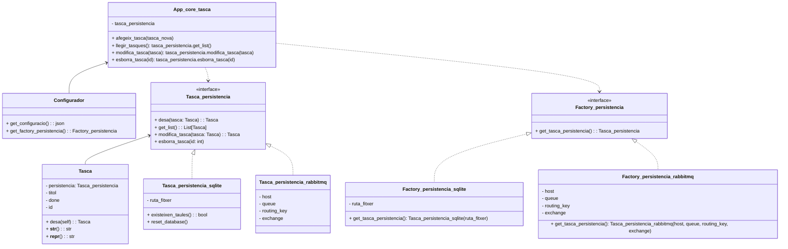

```mermaid

classDiagram
    class Configurador {
        + get_configuracio(): json
        + get_factory_persistencia(): Factory_persistencia
    }
    class App_core_tasca {
        - tasca_persistencia
        + afegeix_tasca(tasca_nova)
        + llegir_tasques(): tasca_persistencia.get_list()
        + modifica_tasca(tasca): tasca_persistencia.modifica_tasca(tasca)
        + esborra_tasca(id): tasca_persistencia.esborra_tasca(id)
    }

    class Tasca {
        - persistencia: Tasca_persistencia
        - titol
        - done
        - id
        + desa(self): Tasca
        + __str__(): str
        + __repr__(): str<json>
    }
    class Tasca_persistencia {
        <<interface>>
        + desa(tasca: Tasca): Tasca
        + get_list(): List[Tasca]
        + modifica_tasca(tasca: Tasca): Tasca
        + esborra_tasca(id: int)
    }
    class Tasca_persistencia_sqlite {
        - ruta_fitxer
        + existeixen_taules(): bool
        + reset_database()

    }
    class Tasca_persistencia_rabbitmq {
        - host
        - queue
        - routing_key
        - exchange
    }
    
    class Factory_persistencia {
        <<interface>>
        + get_tasca_persistencia(): Tasca_persistencia
    }
    class Factory_persistencia_sqlite {
        - ruta_fitxer
        + get_tasca_persistencia(): Tasca_persistencia_sqlite(ruta_fitxer)
    }
    class Factory_persistencia_rabbitmq {
        - host
        - queue
        - routing_key
        - exchange
        + get_tasca_persistencia(): Tasca_persistencia_rabbitmq(host, queue, routing_key, exchange)
    }


    
    App_core_tasca ..> Tasca_persistencia
    App_core_tasca ..> Factory_persistencia
    App_core_tasca <-- Configurador
    
    Factory_persistencia <|.. Factory_persistencia_sqlite
    Factory_persistencia <|.. Factory_persistencia_rabbitmq

    Tasca_persistencia <-- Tasca
    Tasca_persistencia <|.. Tasca_persistencia_sqlite
    Tasca_persistencia <|.. Tasca_persistencia_rabbitmq

    


```